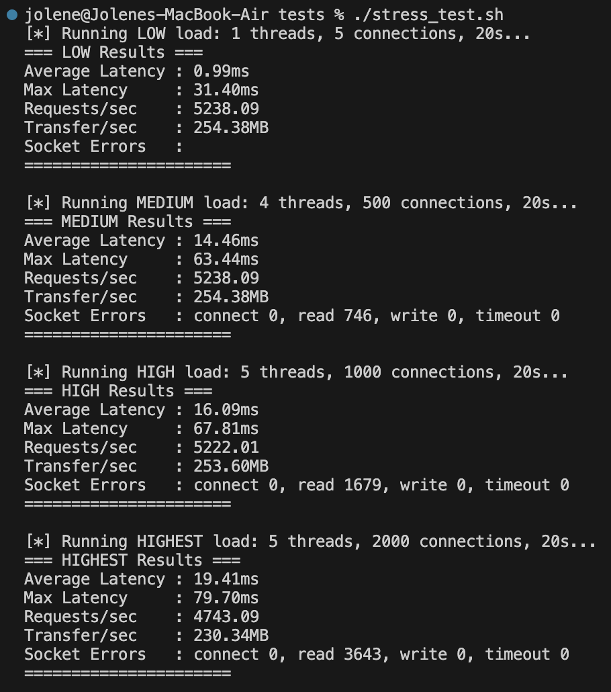
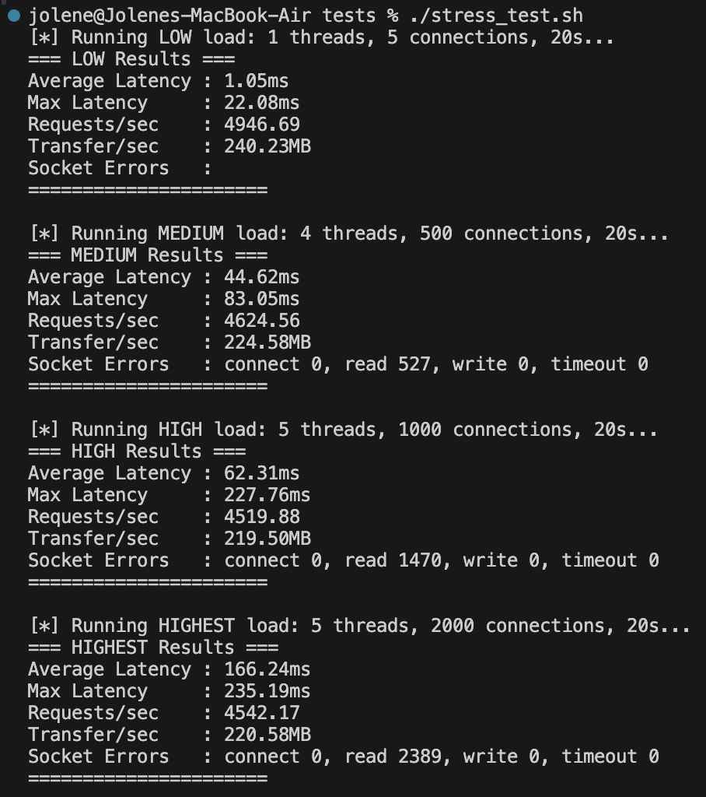
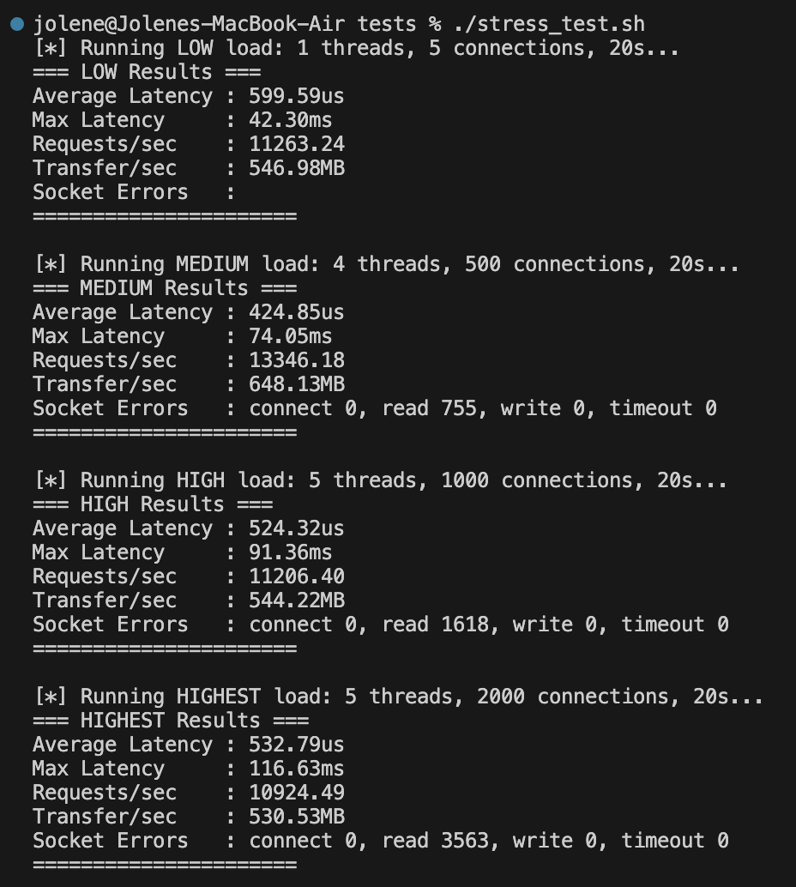
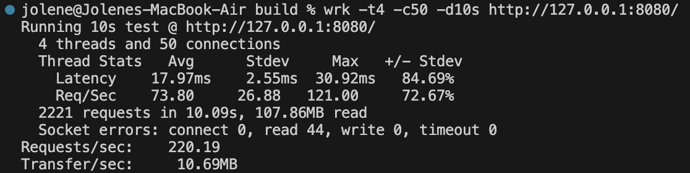
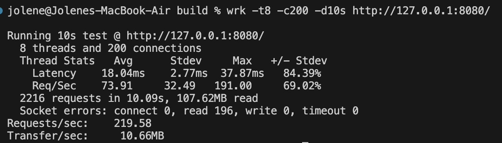
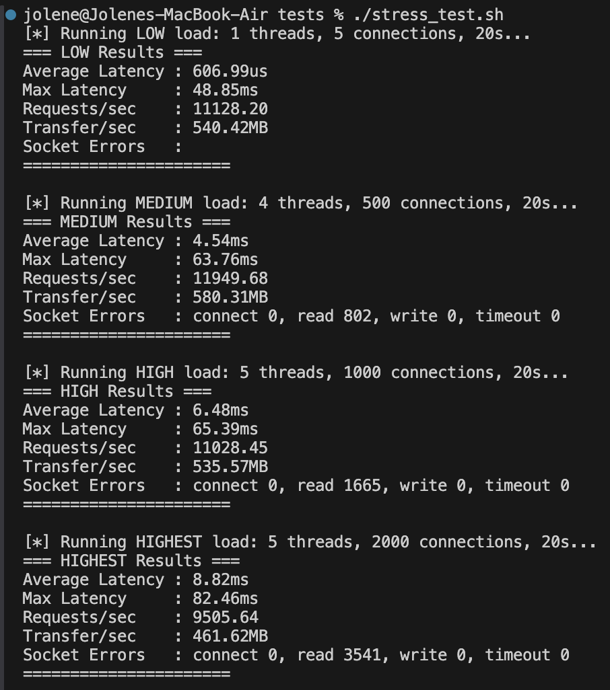
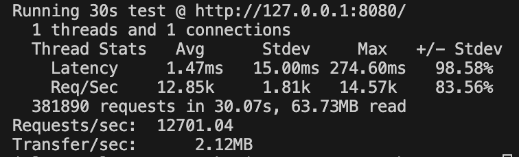

# concurrent-web-server

Just a concurrent web server I wrote to learn more about writing concurrent programs and networking in C++.

## What is a Web Server?

At its very minimal, a web server receives HTTP requests and responds with a certain resource stored on the (physical) server. Like so:

## Features

1. The web server is able to listen for a connection and respond with the resource.
2. The web server is able to handle concurrent requests (request time at the same time). It does this by:

- a) Multithreading/Multiprocessing - use a separate thread for each connection. Server delegates tasks to each thread per request.
- b) Asynchronous I/O
- c) Connection Reuse / Pooling - Minimize overhead of setting up new connections for every request, by maintaining a pool of open connections

## Roadmap

- [] Build a sequential web server.
- [] Write tests + benchmark under high load. (Eg. latency per request, server throughput, ie. number of requests served per second)
- [] Build a concurrent web server with a pool of connections; one thread per connection.
- [] Wrtie tests + benchmark under high load. (Eg. average waiting time per request; percentage of requests dropped)

## 3) The First Benchmarks

### Throughput (requests/second)

With low load (1 thread and 1 connection socket on client):

With higher load, throughput remains relatively constant. Read errors also start to appear.

Higher load, even more connections.

I changed to use a HTML file with 50KB file size instead so that the differences in latency would be more meaningful - for instance, now we see the average latency lies in the ms range.

1. Low load - minimal to no concurrent requests; raw sequential performance
   `wrk -t1 c1 -d10s`
2. Light concurrency
   `wrk -t2 -c10 -d10s` - simulating 10 concurrent clients
   
3. Medium load - some level of concurrent requests
   `wrk -t4 -c50 -d10s http://127.0.0.1:8080/`
   
4. High load - high level of concurrent requests
   `wrk -t8 -c200 -d10s http://127.0.0.1:8080/`
   

Our read errors are increasing! Latency also starts increasing.

We can see our throughput remains relatively constant throughout. This is because our server is currently single-threaded and this is the max throughput it can handle - susequent requests are dropped if they cant fit in the queue.

### Latency Per Request

I used single thread for this

10s

30s

### Takeaways

- ~10–12k requests/sec on average
- Sub-millisecond average latency (tiny files only)
- Errors appear when concurrency rises → that’s the signal to move on to threading / pooling
