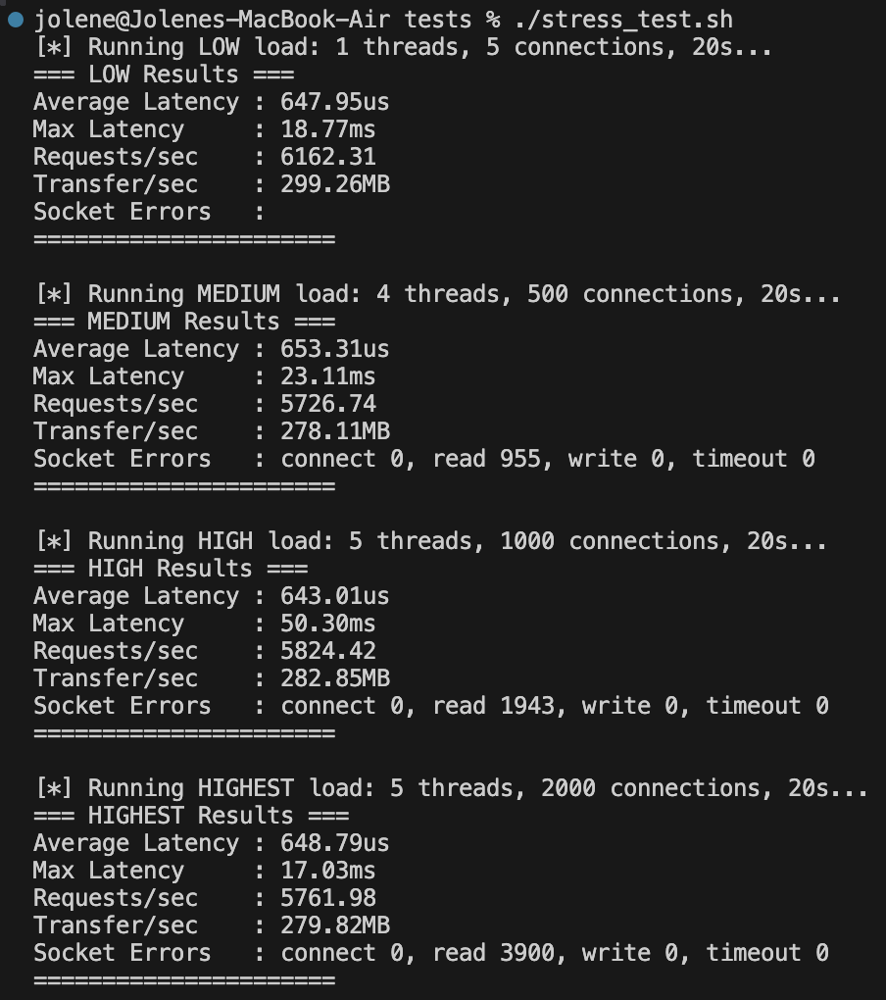

# concurrent-web-server

Just a concurrent web server I wrote to learn more about writing concurrent programs and networking in C++.

## What is a Web Server?

At its very minimal, a web server receives HTTP requests and responds with a certain resource stored on the (physical) server. Like so:

## Features

1. The web server is able to listen for a connection and respond with the resource.
2. The web server is able to handle concurrent requests (request time at the same time). It does this by:

- a) Multithreading/Multiprocessing - use a separate thread for each connection. Server delegates tasks to each thread per request.
- b) Asynchronous I/O
- c) Connection Reuse / Pooling - Minimize overhead of setting up new connections for every request, by maintaining a pool of open connections

## Roadmap

- [] Build a sequential web server.
- [] Write tests + benchmark under high load. (Eg. latency per request, server throughput, ie. number of requests served per second)
- [] Build a concurrent web server with a pool of connections; one thread per connection.
- [] Wrtie tests + benchmark under high load. (Eg. average waiting time per request; percentage of requests dropped)

## 3) The First Benchmarks

### Throughput (requests/second)

### Latency Per Request
