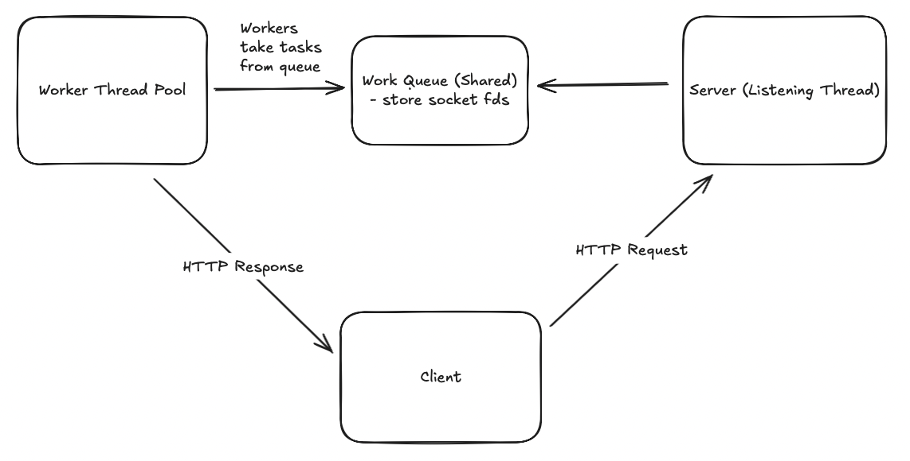

# concurrent-web-server

Just a concurrent web server I wrote to learn more about writing concurrent programs and networking in C++.

## What is a Web Server?

A very minimal web server server receives HTTP requests and responds with a certain resource.

## Features

1. The web server is able to listen for a connection and respond with the resource.
2. The web server is able to handle concurrent requests (request time at the same time). It does this by:

- a) Multithreading/Multiprocessing - use a separate thread for each connection. Server delegates tasks to each thread per request.
- b) Asynchronous I/O
- c) Connection Reuse / Pooling - Minimize overhead of setting up new connections for every request, by maintaining a pool of open connections

## Roadmap

- [x] Build a sequential web server.
- [x] Write tests + benchmark under high load. (Eg. latency per request, server throughput, ie. number of requests served per second)
- [x] Build a concurrent web server with a pool of connections; one thread per connection.
- [x] Wrtie tests + benchmark under high load. (Eg. average waiting time per request; percentage of requests dropped)

## 4) Architecture Diagram - Concurent Web Server

## 3) Stress Tests

### Single Threaded (No queue, no synchronization)

### Single Threaded (One Worker Thread, Queue Size 100)

- Slower than with no synchronization
- Possible reasons: every push and pop has the overhead of locking/unlocking the mutex, increasing average latency by about a factor of 30 at high load.

### Single Threaded (One Worker Thread, Queue Size 1000)

I was unpleasantly surprised to find that average latency per request increased by a factor of 8 for the highest load, when I increased queue size.

But it makes sense because now, if a request can't be served on time, instead of being dropped, it now waits in the queue, and hence average latency increases as waiting time increases.

However, one observation is that read errors decreased, possibly because there is a higher percentage of successful requests.

### Multi-Threaded (3 Worker Threads, Queue Size 100)

I decided to bound my queue size so that average request latency would be lower. It would be better for a request to fail early (and retry) than to wait in the queue a long time.

With 3 worker threads, we see an improvement in request latencies as compared to one worker thread & queue size 100.

### Multi-Threaded (10 Worker Threads, Queue Size 100)

### Multi-Threaded (20 Worker Threads, Queue Size 100)

### Comparison

| Worker Threads      | Avg Latency (µs/ms)                 | Req/s          | Throughput (MB/s) | Observations                                                                     |
| ------------------- | ----------------------------------- | -------------- | ----------------- | -------------------------------------------------------------------------------- |
| **Naive (no sync)** | ~0.64 ms (LOW) → ~0.65 ms (HIGHEST) | ~5 700–6 100   | ~280–300 MB/s     | Baseline unsynchronized server; moderate throughput but unsafe under concurrency |
| **1**               | ~0.99 ms (LOW) → ~19 ms (HIGHEST)   | ~5 200         | ~254 MB/s         | Baseline single-threaded (sequential)                                            |
| **3**               | ~0.6 ms (LOW) → ~8 ms (HIGHEST)     | ~11 000        | ~540 MB/s         | Big jump in throughput; latency cut in half                                      |
| **10**              | ~0.42–0.53 ms                       | ~11 000–13 000 | ~530–650 MB/s     | Peak throughput; lowest latency                                                  |
| **20**              | ~0.6–0.9 ms                         | ~8 600–9 600   | ~420–460 MB/s     | Throughput _drops_ again; diminishing returns                                    |

From the results, it's clear how having too little threads to service requests leads to high latency, but having too many past a certain point leads to diminishing returns as high contention for a bounded queue leads to greater overhead. It shows how tweaking parameters are just as important as the system's design.

Latency aside, we see how throughput is much higher with multiple threads handling our workload - it improves by a factor of 2!

## 4) Future Improvements

- Queue could be refactored to have more granular locking, possibly even lock-free to minimize contention.
- I did not implement security mesasures in this HTTP server; which is equally as vital for a production-grade HTTP server.
